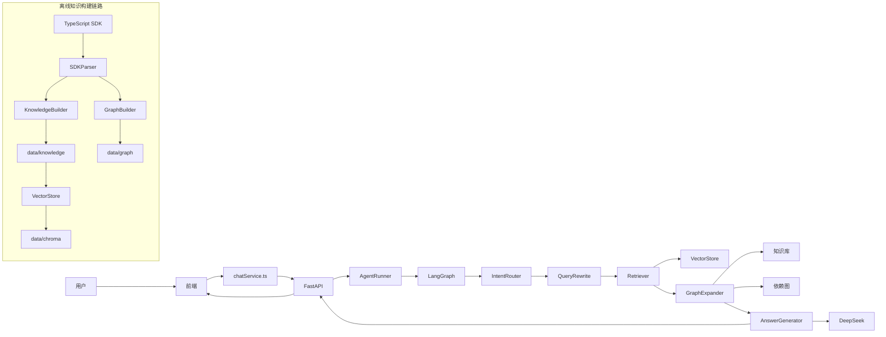
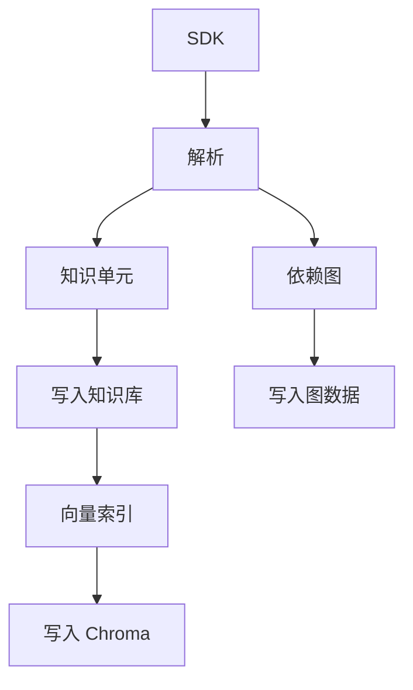
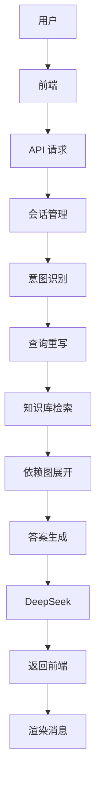

# 插件开发 AI Agent

> 基于 LangGraph + DeepSeek 的 SDK 智能问答助手

## 从零到可用

1. 配置项目根目录 `.env`，写入 `DEEPSEEK_API_KEY=...`
2. 构建知识库：`python scripts/run_pipeline.py`
3. 启动后端和前端：先执行 `uvicorn app.main:app --reload --port 8000`，再执行 `cd frontend && npm run dev`

## 项目简介

插件开发 AI Agent 是一个面向设计平台开放平台插件开发者的智能问答助手。它能自动回答关于 SDK、API 和插件开发的问题，支持多轮对话、代码示例生成、参数说明和来源引用，帮助开发者减少等待人工回复的时间，降低技术支持成本。

### 核心能力

- **文档问答**：基于 SDK 知识库自动回答开发问题
- **SDK 问答**：解析 `@manycore/idp-sdk` 类型定义，提供精准的 API / 接口 / 类型说明
- **代码生成**：根据问题生成可直接运行的 TypeScript/JavaScript 代码示例
- **参数说明**：详细解释函数参数、返回值类型和枚举值含义
- **多轮对话**：支持上下文感知的连续对话
- **来源引用**：所有回答附带 SDK 版本和源文件引用，保证可信

## 项目架构图



## 技术架构

该项目由两条主链路组成：
- **在线问答链路**：用户在前端提问，经由后端 API 进入 LangGraph Agent，最终返回答案
- **离线构建链路**：SDK 解析后生成知识库、依赖图和向量索引

在线回答时，Agent 会先做意图识别和查询重写，再进行知识库检索与依赖图展开，最后由模型生成带来源引用的回答。

## 技术栈

| 模块 | 技术 |
|------|------|
| 后端框架 | Python 3.11 + FastAPI |
| LLM | DeepSeek Chat（`deepseek-chat`，通过 `ChatOpenAI` 接入） |
| Agent 框架 | LangGraph + LangChain |
| 知识库检索 | Chroma + sentence-transformers（`all-MiniLM-L6-v2`） |
| SDK 解析 | tree-sitter（TypeScript AST） |
| 前端 | Next.js 16 + React 19 + Tailwind CSS 4 |
| 代码展示 | Monaco Editor（前端依赖已安装） |
| 评测 | RAGAS |

## 项目结构

```
├── agent/                  # LangGraph Agent 核心逻辑
│   ├── assistant.py        # Agent 节点定义与状态图
│   └── __init__.py         # Agent Runner 入口
├── app/                    # FastAPI 后端服务
│   └── main.py             # API 路由定义
├── frontend/               # Next.js 前端聊天界面
│   └── src/
│       ├── app/            # Next.js App Router
│       ├── components/     # 聊天 UI 组件
│       ├── services/       # 前端 API 服务
│       └── types/          # TypeScript 类型定义
├── sdk_parser/             # TypeScript AST 解析器
│   ├── parser.py           # tree-sitter 解析逻辑
│   └── models.py           # 符号模型定义
├── knowledge_builder/      # 知识库构建
│   └── builder.py          # Markdown + JSON 生成
├── graph_builder/          # 类型依赖图构建
│   └── __init__.py
├── vector_store/           # 向量存储与检索
│   └── store.py            # Chroma 封装
├── prompts/                # 系统提示词
│   └── system.md           # Agent 系统提示词
├── scripts/                # 工具脚本
│   └── run_pipeline.py     # 端到端流水线
├── eval/                   # 自动评测
│   ├── run_eval.py         # 评测脚本
│   └── test_data.json      # 测试数据集
├── data/                   # 数据目录
│   ├── chroma/             # Chroma 向量数据库
│   ├── knowledge/          # 知识库（Markdown + JSON）
│   └── graph/              # 依赖图数据
├── spec.md                 # 产品规格文档
└── package.json            # Node.js SDK 依赖
```

## 快速开始

### 前置要求

- Python 3.11+
- Node.js 18+
- DeepSeek API Key

### 1. 安装依赖

先安装后端与项目根目录依赖，再安装前端依赖：

```bash
# 项目根目录依赖
npm install

# 前端依赖
cd frontend && npm install
```

> 说明：后端依赖由当前 Python 环境管理，建议使用项目已有的虚拟环境运行后端；如果你是在新环境中首次启动，请先确保 `fastapi`、`uvicorn`、`langchain`、`langgraph` 等依赖已安装。

### 2. 配置环境变量

在项目根目录创建 `.env` 文件：

```env
DEEPSEEK_API_KEY=your_api_key_here
```

后端启动时会自动读取项目根目录的 `.env`，并在日志中打印 DeepSeek key 是否已加载。

### 3. 构建知识库

首次启动或更新 SDK 文档后，先构建知识库：

```bash
python scripts/run_pipeline.py
```

这一步会解析 SDK、生成知识库文档、构建依赖图，并更新向量索引。

### 4. 同步 RAG 文档

如果你更新了 `docs/rag/` 下的酷家乐插件文档，先同步到知识库，再重建索引：

```bash
python scripts/sync_rag_docs.py
```

该脚本会把 `docs/rag/**/*.md` 转成 `data/knowledge/` 下可入库的 Markdown / JSON，并更新 `_index.json`，随后按需重建 `data/chroma/`。

### 5. 校验 RAG 文档召回

项目提供了专项评测样本，包含 `rag_doc` 类问题，用于验证新增的 `docs/rag` 文档是否能被检索到：

```bash
python eval/run_eval.py
```

你也可以直接用 `VectorStore.search()` 对 `docs/rag` 里的关键词做检索检查。

### 6. 离线知识构建流程

项目在首次启动或 SDK 文档更新后，需要先执行知识构建流水线：



### 7. 在线问答流程

用户在前端输入问题后，系统会经过如下步骤返回答案：



### 8. 启动后端

在项目根目录启动 FastAPI 服务：

```bash
uvicorn app.main:app --reload --port 8000
```

启动成功后可以访问：

- 健康检查：`http://localhost:8000/api/health`
- 对话接口：`http://localhost:8000/api/chat`

### 9. 启动前端

另开一个终端，进入前端目录并启动 Next.js：

```bash
cd frontend && npm run dev
```

启动后访问：

- `http://localhost:3000`

前端默认通过 `NEXT_PUBLIC_API_URL` 访问后端；本地开发未单独配置时，默认指向 `http://localhost:8000`。

### 10. 本地运行校验

按下面顺序确认服务是否正常：

1. 后端健康检查返回 `200`：`GET /api/health`
2. 打开前端首页，能看到“插件开发 AI 助手”页面
3. 发送一条问题，例如：`IDP.Miniapp.exit 怎么使用？`
4. 确认页面能返回回答，并且不会再出现网络连接失败

### 11. 常见问题

- **启动日志提示未加载 DeepSeek key**：检查项目根目录 `.env` 是否存在，以及 `DEEPSEEK_API_KEY` 是否写在当前运行环境可读取的位置。
- **端口 8000 被占用**：停止占用进程，或修改后端启动端口。
- **端口 3000 被占用**：停止占用进程，或让 Next.js 换一个端口启动。
- **回答质量很差或提示没有知识**：先确认是否已执行 `python scripts/run_pipeline.py` 重新构建知识库。
- **前端显示接口错误**：先确认后端 `http://localhost:8000/api/health` 是否正常，再检查前端是否仍在访问默认后端地址。

## LangGraph Agent 节点

1. **Intent Router** — 识别问题类型（API / SDK / 参数 / 代码 / 其他）
2. **Query Rewrite** — 补全多轮对话上下文
3. **Retrieve** — 知识库 Top-K 检索
4. **Graph Expansion** — 类型依赖链展开
5. **Answer Generator** — 生成回答 + 代码示例 + 来源引用
6. **Memory** — 会话历史管理

## API 接口

| 方法 | 路径 | 说明 |
|------|------|------|
| GET | `/api/health` | 健康检查 |
| POST | `/api/chat` | 对话接口 |
| GET | `/api/chat/history` | 获取会话历史 |

## 进阶使用

### 评测

项目包含基于 RAGAS 的自动评测框架，适合在服务已可用后做效果验证和回归测试：

```bash
python eval/run_eval.py
```

评测指标：
- **Recall@1/3/5**：检索召回率
- **Answer Correctness**：答案正确性
- **Faithfulness**：答案忠实度（基于引用检测）

## 更新日志

详见 [CHANGELOG.md](CHANGELOG.md)

## 许可证

本项目仅供内部使用。
