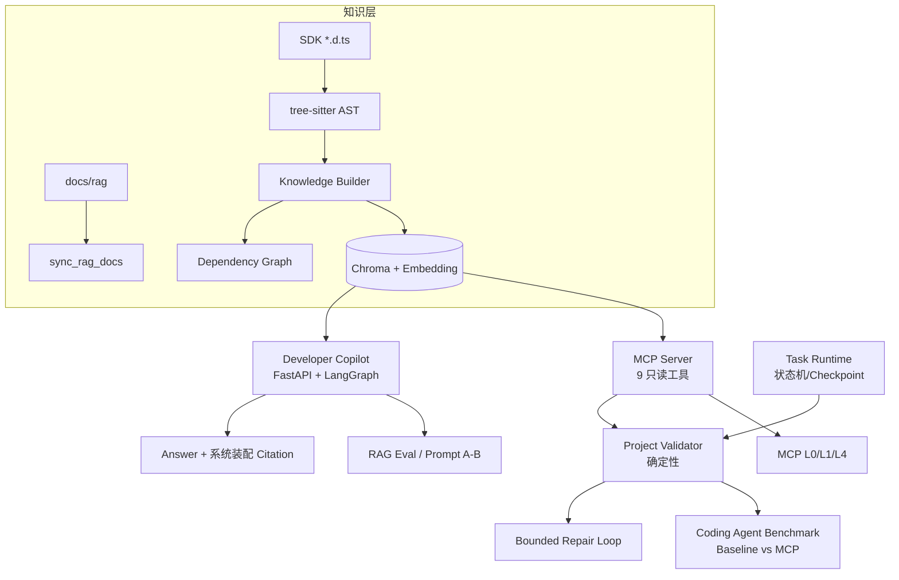

# Plugin Dev Helper

[](https://github.com/jonji886/plugin-dev-helper/actions/workflows/ci.yml)

**Plugin Dev Helper 是面向设计平台插件开发场景的 Developer AI Engineering System。**
它把插件 SDK（`*.d.ts`）与开发文档构建成可检索、可引用的结构化知识，通过 **Chat Copilot** 服务开发者，
通过 **MCP Server** 把同一份能力提供给 Coding Agent，并用**不依赖 LLM 的确定性校验**判定 Agent 产出是否可交付。

它服务三类对象：**开发者**（查 API、懂参数、看源码）、**Coding Agent**（获取领域知识、做平台约束自检）、
**项目维护者**（回归评测、观测与修复闭环）。

它维护的不是「答案看起来像不像」，而是**可验证的工程事实**：每条引用可回溯到源码行号与 SDK 版本，
每个 Agent 产出都要过确定性 Validator，每个 AI 能力变化都要过分层评测。
所以它不是普通 RAG Demo，也不是只会聊天的知识库。

---

## 30 秒概览

| 维度 | 实现 |
|---|---|
| Problem | 插件 SDK/文档分散、类型复杂、API 易幻觉、Agent 缺领域上下文、产出缺确定性验证 |
| Knowledge | tree-sitter AST 解析 `*.d.ts` + 文档知识单元 + networkx 依赖图 |
| RAG | 语义检索（Chroma + `all-MiniLM-L6-v2`）+ 词法打分（hybrid），LangGraph 编排，**系统装配可验证 Citation** |
| MCP | 9 个只读工具，供宿主 IDE / Coding Agent 调用 SDK 查询与校验能力 |
| Coding Agent | Project Validator（确定性）+ Task Runtime（状态机/Checkpoint/Resume/Artifact 版本）+ 有界 Repair Loop |
| Reliability | LLM 输出不可信 → 瞬时错误 Retry + 确定性校验 + Build Gate → 通过 / 有界修复 / 拒绝，不把 Prompt 当可靠性边界 |
| Evaluation | RAG Eval、Prompt A/B + 回归门禁、MCP L0/L1/L4、Agent 轨迹 L2、端到端 Benchmark L3 |
| Observability | SQLite 请求指标（延迟 / token / 估算成本 / 模型路由）+ MCP telemetry + 可选 Langfuse |

---

## 系统架构


```mermaid
flowchart TB
  subgraph KB[知识层]
    DTS[SDK *.d.ts] --> AST[tree-sitter AST]
    MD[docs/rag] --> SYNC[sync_rag_docs]
    AST --> KBB[Knowledge Builder] --> GRAPH[Dependency Graph]
    KBB --> VS[(Chroma + Embedding)]
  end
  VS --> COPILOT[Developer Copilot\nFastAPI + LangGraph]
  VS --> MCP[MCP Server\n9 只读工具]
  COPILOT --> RAG[Answer + 系统装配 Citation]
  MCP --> VALID[Project Validator\n确定性]
  RT[Task Runtime\n状态机/Checkpoint] --> VALID
  VALID --> REPAIR[Bounded Repair Loop]
  COPILOT --> EVAL[RAG Eval / Prompt A-B]
  MCP --> MCPEV[MCP L0/L1/L4]
  VALID --> BENCH[Coding Agent Benchmark\nBaseline vs MCP]
```

Copilot 与 MCP **共享同一份知识索引与向量库**；Task Runtime 与 MCP 调用**同一个 Project Validator**；
Benchmark 复用同一 Validator 与轨迹评分器。详见 [`spec.md`](spec.md)。

---

## 核心能力

### 1. 结构化开发者知识
`*.d.ts` 经 tree-sitter 解析为符号单元（interface / type / enum / function / const），保留命名空间、
参数、必填性、别名、**源码行号**与 **SDK 版本**；networkx 构建依赖图。产物在 `data/knowledge/` 与 `data/graph/`。

### 2. Developer Copilot
LangGraph 固定节点：意图识别 → 多轮问题重写 → hybrid 检索 → 依赖图展开 → 回答生成。
**Citation 由系统确定性装配**（依据检索结果 + 知识索引），不是 LLM 生成，并做 `citation_validity` 校验。

### 3. MCP for Coding Agents
一个**只读** MCP Server（Streamable HTTP），把 SDK 查询与校验能力暴露给宿主 IDE / Coding Agent：

| 工具 | 作用 |
|---|---|
| `search_docs` | 自然语言检索 SDK/API/文档 |
| `get_api` / `get_type` | 精确查 API / 类型定义；未命中返回 `candidate_symbols`，不冒充精确结果 |
| `get_related_symbols` | 依赖 / 被引展开 |
| `get_examples` | 返回真实代码示例（不临时生成） |
| `validate_api_usage` | 单段代码 API 用法静态校验 |
| `get_plugin_constraints` | 平台结构约束（Rule Layer） |
| `get_plugin_scaffold` | 最小插件骨架（`vanilla` / `react-ts-webpack`） |
| `validate_plugin_project` | 项目级确定性校验 |

### 4. Deterministic Validation
`ProjectValidator` 做五类检查：STRUCTURE / MANIFEST / RULE / API / BUILD。
API 类检查复用与查询侧同一份知识索引，可检出**不存在的 API、错误命名空间、错误参数名、缺失必填**。
CORS / OPTIONS 等宿主运行期行为静态不可判定，显式标记「需宿主环境验证」，不静态宣布通过。

### 5. Task Runtime & Repair
状态机驱动的任务生命周期（非法迁移显式报错）、SQLite 持久化、Checkpoint / Resume、Artifact 版本、
失败分类（Error Taxonomy：RETRYABLE / REPAIRABLE / NON_RETRYABLE）与根因分析。
**Runtime Retry**（仅瞬时错误退避重试，权限/配置错误不重试，耗尽 `RETRY_EXHAUSTED`）、
**Build Gate**（配置了 `build_cmd` 才真正执行构建；未配置 `BUILD_SKIPPED`）、
修复为**有界**（默认 2 次）、证据驱动、修复后**重校验**。

### 6. Evaluation & Observability
分层评测（见下方表格）+ SQLite 请求指标（延迟 / token / 估算成本 / 模型路由）+ MCP telemetry；Langfuse 可选。

---

## Why MCP（不只是 RAG Chat）

```text
Chat  → 给人答案
MCP   → 给 Agent 结构化、可调用、可验证的能力
```

RAG 回答「`IDP.Miniapp.exit` 怎么用」是靠自然语言；而 Coding Agent 在真实工程里需要的是
**可被程序调用的精确查询与校验**：`get_api` 精确命中符号、`get_type` 给出必填字段、
`validate_api_usage` / `validate_plugin_project` 直接判定代码是否违反平台约束。
MCP 把这套能力从「给人看的文本」变成「给 Agent 用的接口」，并用统一的确定性 Validator 收敛产出质量。

---

## Reliability（核心理念）

```text
Agent / LLM output（不可信）
        ↓
Retry Policy（瞬时错误退避重试，权限/配置错误不重试）
        ↓
Deterministic Validator（不依赖 LLM）
   ├─ Static Validation（结构/契约/API/RULE）
   └─ Build Gate（配置了 build 命令才真正执行；未配置=SKIPPED，不冒充通过）
        ↓
   PASS ──────── REPAIR（有界 2 次，重校验） ──────── REJECT / FAILED（记录根因）
   RETRY_EXHAUSTED ──────────────────────── FAILED（记录 last_error / attempts）
```

三条路径必须区分清楚，不可混用：

- **Retry（重试）**：针对 Agent / Provider / MCP **瞬时**错误（超时、HTTP 429/5xx、临时网络抖动）。
  依据 `ErrorTaxonomy` 分类：`RETRYABLE` 才退避重试；`NON_RETRYABLE`（401/403/权限/配置）**立即判失败，绝不重试**；
  `REPAIRABLE`（API 幻觉、代码校验失败）交给 Repair Loop，不走 Retry。`RetryPolicy` 控制
  `max_attempts`、指数退避（`backoff_base_seconds` × `backoff_factor^(attempt-1)`），耗尽后状态
  `FAILED`、原因 `RETRY_EXHAUSTED`，并保留 `last_error / attempts / taxonomy` 与完整 Trace。
- **Repair（修复）**：Agent 产物**首次生成成功但校验失败**时，依据 Validator Evidence 做有界修复，修复后**重校验**。
- **Resume（恢复）**：进程崩溃后从最新 Checkpoint 继续，不重复已完成步骤。

`Static Validation ≠ Build Verification`：Validator 的静态检查（含类型检查）通过，**不等于**构建真正通过。
配置了 `build_cmd` 时，`TaskRuntime` 用 `subprocess` 真正执行构建（捕获 exit_code / stdout / stderr / duration /
timeout），exit_code ≠ 0 即 `BUILD_FAILED` 并阻断交付；**未配置 build 命令时明确标记 `BUILD_SKIPPED`，绝不冒充编译通过**。

> 不把 Prompt 当作可靠性边界。能确定性判定的都确定性判定；不能静态判定的（CORS / OPTIONS）
> 明确标记为需宿主验证，而不是假装通过。

---

## Evaluation（分层）

| Layer | Target | Agent Required? | Status | Command |
|---|---|---|---|---|
| RAG Eval | Recall@1/3/5 + 答案正确性 + Citation Validity | 是（LLM） | 已执行（有真实报告） | `python eval/run_eval.py` |
| Prompt A/B + Gate | 两 Prompt 版本对比 + 回归门禁 | 是（LLM） | 已执行 | `python scripts/run_prompt_eval.py --baseline v1 --candidate v2` |
| MCP L0（工具级） | 契约 / 边界 / not_found / 降级 / 幂等（58 条） | 否 | 已执行，GATE PASS | `python scripts/run_mcp_eval.py` |
| MCP L1（多轮序列） | 跨步骤引用 / 指代传递（6 条） | 否 | 已执行，6/6 | `python scripts/run_mcp_sequences.py` |
| Agent L2（轨迹） | 工具选择 F1 / 符号覆盖 / 冗余率 / 序列 / 拒答 | 否 | 已有真实轨迹 | `python scripts/check_agent_trace.py benchmark/traces/<run>.json` |
| Agent E2E L3 | Baseline vs MCP 端到端任务成功率 | 是（真实 Agent） | 已执行（manual, 1 run/task）；First Pass = UNAVAILABLE | `python scripts/run_coding_agent_benchmark.py --driver codebuddy-manual --prepare/--import` |
| MCP L4（稳定性） | 多轮 × 工具 + 并发 + 故障恢复 + 状态泄漏 | 否 | 已执行，GATE PASS | `python scripts/check_mcp_stability.py` |

核心成功判定使用**确定性指标**（Validator + acceptance + 轨迹评分），不以 LLM Judge 为准。

---

## Real CodeBuddy Benchmark（Baseline vs MCP）

> 结果文件：[`benchmark/results/codebuddy-20260921-155307/`](benchmark/results/codebuddy-20260921-155307) ·
> 报告 [`comparison.md`](benchmark/results/codebuddy-20260921-155307/comparison.md)

- **Agent**：CodeBuddy（本机 CLI 存在但无 headless 采集接口 → 采用 `manual / import` 驱动执行）
- **设计**：同一 CodeBuddy、同一 task prompt、同一 fixture，唯一变量为是否可访问 Plugin Dev Helper MCP
- **Baseline 隔离**：baseline 工作区**不写** `.codebuddy/mcp.json`；import 时对每个 baseline run 做
  `verify_isolation`（检查工作区是否意外含 MCP 配置），检测到 MCP 则该 run 标记 `INVALID_ENVIRONMENT`
  并**排除出正式 Baseline 聚合**。无法检查（工作区缺失）时隔离状态 `UNAVAILABLE`。
- **任务**：10 个 · **重复**：1 run/task（**不声称统计稳定**；协议支持 `--runs N`）
- **Evaluator**：`ProjectValidator`（确定性）+ acceptance 字符串断言（非 LLM Judge）

| Metric | Baseline | MCP | Delta |
|---|---:|---:|---:|
| Task Success Rate | **0.6** | **1.0** | +0.4 |
| API Correctness | 0.7 | 1.0 | +0.3 |
| Hallucination Rate | 0.3 | 0.0 | -0.3 |
| Constraint Violation Rate | 0.1 | 0.0 | -0.1 |
| Abstention Correct Rate | 0.5 | 1.0 | +0.5 |
| First Pass Success Rate | UNAVAILABLE | UNAVAILABLE | — |
| Latency / Token | UNAVAILABLE | UNAVAILABLE | — |

> **First Pass Success Rate = UNAVAILABLE**：当前 CodeBuddy 真实轨迹无法可靠区分「首次候选实现」
> 与「后续自修复」，因此**不把 Final Success 当作 First Pass**，也**不伪造**该指标。
> 这是诚实披露，不是能力缺陷。历史 run（`codebuddy-20260921-155307`）曾用旧语义
> （`first_pass = final_acceptance`），其 metadata 已标注为 legacy，不篡改历史。

典型差异：无 MCP 时 Agent 直接采信任务中的错误 API 名（T09 幻觉）、猜错命名空间（T03）、
用真实但不适用的 API（T04）、沿用错误参数名（T08）；接入 MCP 后通过 `get_api` / `get_type`
查证真实符号与字段后修正。

`Latency / Token` 无法从 CodeBuddy 程序化获取，标记 `UNAVAILABLE`（不估算、不伪造）。
`reference` driver 仅用于 harness / evaluator 自检，**不是 Agent Benchmark**。规格与局限详见
[`spec.md` §12](spec.md) 与 [`benchmark/README.md`](benchmark/README.md)。

---

## Quick Start

前置：Python 3.11+、Node.js 18+。推荐配置一个模型 API Key；无密钥时服务仍可展示本地知识库兜底。

```bash
# 1) 安装
python3.11 -m venv .venv
.venv/bin/pip install -e ".[dev]"
npm install && (cd frontend && npm install)

# 2) 构建知识库（AST 解析 → 知识单元 → 依赖图 → 向量索引）
cp .env.example .env          # 按需填写模型 Key
.venv/bin/python scripts/run_pipeline.py

# 3) 启动后端（FastAPI，:8000）
.venv/bin/uvicorn app.main:app --reload --port 8000

# 4) 启动前端（Next.js，:3000）
cd frontend && npm run dev
```

**MCP Server**（Streamable HTTP，默认 `http://127.0.0.1:8001/mcp`）：

```bash
.venv/bin/python -m mcp_server
curl http://127.0.0.1:8001/health
```

MCP 客户端配置示例：

```json
{ "mcpServers": { "plugin-developer-mcp": { "url": "http://127.0.0.1:8001/mcp", "transport": "streamable-http" } } }
```

**测试与评测**：

```bash
.venv/bin/pytest tests/ -q                                     # 全部单元测试（含 Runtime Retry / Build Gate / Benchmark 基础设施）
.venv/bin/python scripts/run_mcp_eval.py                       # MCP L0 工具级
.venv/bin/python scripts/run_mcp_sequences.py                  # MCP L1 多轮序列
.venv/bin/python scripts/check_mcp_stability.py                # MCP L4 稳定性
.venv/bin/python scripts/check_benchmark_task.py --all --mode both   # 任务可解性
.venv/bin/python scripts/check_agent_trace.py --self-test      # 轨迹评分器自检
```

**跑真实 Coding Agent Benchmark（manual）**：

```bash
# 1) 准备隔离工作区（baseline 不写 MCP 配置；mcp 写 .codebuddy/mcp.json）
.venv/bin/python scripts/run_coding_agent_benchmark.py --driver codebuddy-manual --prepare --runs 1 --mode both
# 2) 在真实 CodeBuddy 中逐一对每个 workspace 执行任务并保存 vm.ts（MCP 条件会真实调用 MCP）
# 3) 回灌并评估 + 生成 aggregate / per-task / failure analysis / comparison.md
.venv/bin/python scripts/run_coding_agent_benchmark.py --driver codebuddy-manual --import --runs 1 --mode both
```

---

## Repository Structure

```text
app/                 FastAPI、配置、SQLite 指标、Observability、模型路由、Prompt Registry
agent/               LangGraph 节点、会话与 Citation；runtime/ 为 Task Runtime / Repair / Trace / 状态机
vector_store/        Chroma 与 hybrid 检索
sdk_parser/          tree-sitter TypeScript AST 解析
knowledge_builder/   知识单元构建 + 依赖图（GraphBuilder）
prompts/             Git-based Prompt 版本
eval/                Golden Dataset、评分、Prompt A/B 报告与 Regression Gate
mcp_server/          MCP Server（tools / services / Rule / telemetry）
rules/               酷家乐结构化 Guardrail 规则
benchmark/           tasks / fixtures / solutions / traces / results（含真实 CodeBuddy 结果）
scripts/             构建、评测入口；agent_drivers/ 为 Benchmark Driver 抽象层
frontend/            Next.js Chat UI 与反馈 UI
docs/                ADR 与架构说明
deploy/              Docker 镜像与 Compose
```

---

## Design Decisions

- [`docs/adr/ADR-001`](docs/adr) 项目级确定性 Validator 作为交付判定唯一事实来源
- [`docs/adr/ADR-002`](docs/adr) Task Runtime 与 LangGraph 内部状态解耦
- [`docs/adr/ADR-003`](docs/adr) 有界 Repair Loop（基于 Validator Evidence）
- [`docs/adr/ADR-004`](docs/adr) Coding Agent Benchmark 控制变量与诚实性原则
- 链路总览：[`docs/architecture-coding-agent-p0.md`](docs/architecture-coding-agent-p0.md)
- 完整规格：[`spec.md`](spec.md) · 评测说明：[`benchmark/README.md`](benchmark/README.md)

---

## Limitations（真实限制）

- Fixture 为最小 TypeScript 工程，不等价于真实宿主插件运行环境。
- 真实 CodeBuddy Benchmark 为 **1 run/task（manual）**，样本量小，不代表统计稳定；协议支持 `--runs N`（推荐 3）。
- **First Pass Success 因 CodeBuddy 轨迹无法区分首次候选实现与自修复，标记 UNAVAILABLE**，不做任何估算或伪造。
- CodeBuddy 的 token / cost / latency 无法程序化获取，标记 `UNAVAILABLE`。
- baseline 是否完全禁用全局 MCP 取决于 CodeBuddy 配置合并行为（已在 metadata 披露；import 时做 `verify_isolation` 校验）。
- `TaskRuntime` 的 Build Gate：**配置了 `build_cmd` 才真正执行构建**（exit_code ≠ 0 → `BUILD_FAILED` 阻断交付）；
  **未配置时明确 `BUILD_SKIPPED`，不冒充编译通过**。当前公开 Benchmark 走 acceptance 字符串断言而非项目级 build 命令。
- acceptance 为字符串断言（注释中的被禁符号也会触发失败）。
- 检索词法侧为自研关键字打分（非 BM25）；`graph_builder/` 为空占位。
- 无多租户鉴权与内容安全过滤；MCP 默认放开跨域。
- 本项目为个人技术 POC，Rule Layer 不代表官方规范的完整或永久版本。

## 许可证

本项目仅供内部学习、演示和作品集展示。
