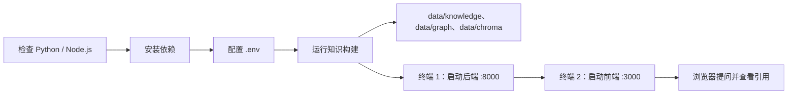
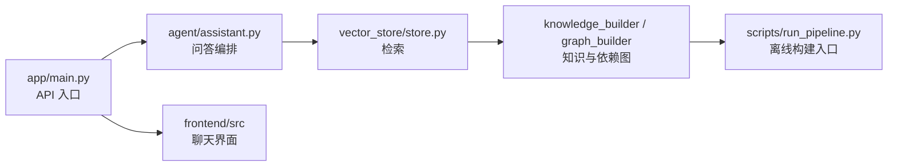
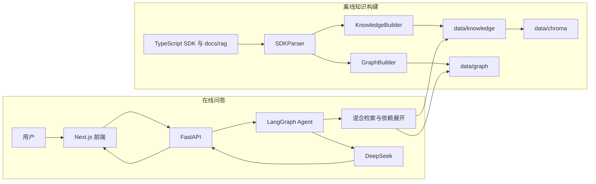
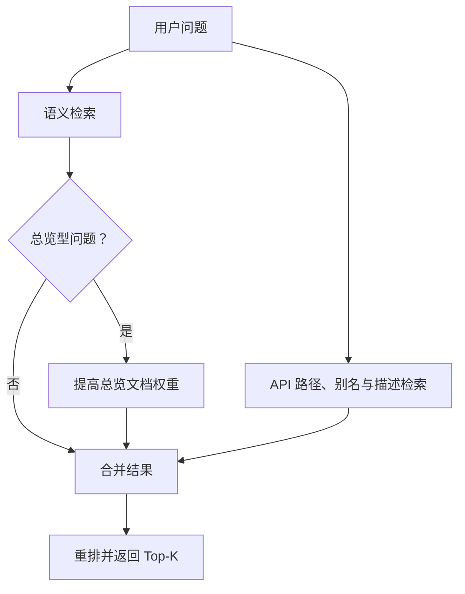

# 插件开发 AI Agent

> 面向设计平台开放平台开发者的 SDK 智能问答助手。

它会将 `@manycore/idp-sdk` 和 `docs/rag/` 中的插件文档构建成知识库，帮助开发者查询 API、理解参数、生成代码示例，并展示可追溯的来源引用。

## 你能用它做什么

- 查询 SDK API、接口、类型和枚举值
- 根据问题生成 TypeScript / JavaScript 代码示例
- 结合上下文进行多轮问答
- 查看回答对应的 SDK 版本、源文件和行号（有检索结果时）

## 需求价值与衡量方式

该项目的核心价值是把可标准化的 SDK 与插件开发咨询转为可自助、可验证的问答：开发者更快获得答案，技术支持可以把精力集中在复杂或未覆盖的问题上。系统不将尚未采集基线的业务收益写成既成事实，而是通过下列指标持续验证效果。

| 价值 | 衡量指标 | 当前机制 / 质量门槛 |
|---|---|---|
| 更容易找到正确的 SDK 文档 | `Recall@5` | 离线评测门槛为 **≥ 85%** |
| 回答更可靠 | 答案正确率、来源有效率 | 离线评测门槛分别为 **≥ 80%**、**≥ 90%** |
| 回答过程可追溯 | 引用率 | 每次问答记录是否返回结构化来源引用 |
| 问答服务可用且响应稳定 | 成功率、P50 / P95 延迟 | 记录请求、检索和模型调用耗时 |
| 开发者感知价值可反馈 | 有帮助率、负反馈原因 | 前端反馈关联到单次请求，并可导出失败候选案例 |

`GET /api/metrics` 会基于**最近 1,000 条请求**返回成功率、P50/P95 延迟、平均检索/模型耗时、引用率和有帮助率；`GET /api/metrics/failures` 用于定位请求失败、无检索结果、无引用或收到负反馈的案例。检索与回答门槛可通过 `.venv/bin/python eval/run_eval.py` 验证。

### 业务收益如何量化

上线前先连续采集至少一个完整业务周期的人工支持基线；上线后在相同周期、相近咨询量下对比。建议按以下口径计算，具体目标值由基线数据确定：

| 业务收益 | 计算方式 |
|---|---|
| 人工答疑量下降率 | `(上线前单位周期人工答疑量 - 上线后单位周期人工答疑量) / 上线前单位周期人工答疑量` |
| 首次响应时间缩短率 | `(上线前人工首次响应时间中位数 - AI 首次响应时间中位数) / 上线前人工首次响应时间中位数` |
| 自助解决率 | `未转人工且获得正向反馈的问答数 / 全部 AI 问答数` |
| 知识覆盖改善 | `(本周期 Recall@5 - 上一周期 Recall@5) / 上一周期 Recall@5` |

人工答疑量、人工首次响应时间和是否转人工需要从客服或工单系统采集；当前应用自动记录的是 AI 问答的运行指标、引用情况和用户反馈。

> 表中的百分比是质量门槛或计算口径，不代表当前生产成效；请在取得基线和上线数据后补充实际结果与目标值。

## 首次运行（按此顺序操作）

### 开始前

请确认本机已安装：

- Python 3.11+
- Node.js 18+
- DeepSeek API Key（推荐配置；未配置时服务仍可启动，但只返回本地知识库兜底内容）

### 1. 安装依赖

在项目根目录执行：

```bash
python3.11 -m venv .venv
.venv/bin/pip install -e ".[dev]"
npm install
cd frontend && npm install
```

`npm install` 必须在项目根目录执行，它会安装知识构建所需的 SDK；前端依赖则安装在 `frontend/` 中。

### 2. 配置模型密钥

在项目根目录创建 `.env` 文件：

```env
DEEPSEEK_API_KEY=your_api_key_here
```

后端会自动读取这个文件，并在启动日志中提示密钥是否已加载。`.env` 文件统一使用 `KEY=value` 格式，不要添加 `export` 前缀。

### 3. 构建知识库

```bash
.venv/bin/python scripts/run_pipeline.py
```

首次构建会解析 SDK、同步 RAG 文档、生成依赖图并创建向量索引；结束时应看到“构建完成!”以及知识单元和向量文档数量。

### 4. 启动两个服务

保持当前终端在项目根目录，启动后端：

```bash
.venv/bin/uvicorn app.main:app --reload --port 8000
```

另开一个终端，启动前端：

```bash
cd frontend && npm run dev
```

### 5. 验证成功

1. 浏览器打开 `http://localhost:8000/api/health`，应返回包含 `"status":"ok"` 的 JSON。
2. 打开 `http://localhost:3000`，应看到“插件开发 AI 助手”页面。
3. 发送问题：`IDP.Miniapp.exit 怎么使用？`。
4. 页面应返回回答；有相关知识时，回答下方会显示来源引用。

### 首次运行地图


```mermaid
flowchart LR
  A[检查 Python / Node.js] --> B[安装依赖]
  B --> C[配置 .env]
  C --> D[运行知识构建]
  D --> K[data/knowledge、data/graph、data/chroma]
  D --> E[终端 1：启动后端 :8000]
  E --> F[终端 2：启动前端 :3000]
  F --> G[浏览器提问并查看引用]
```

## 常见问题

- **提示未加载 DeepSeek key**：确认项目根目录存在 `.env`，且其中为 `DEEPSEEK_API_KEY=...`；未配置密钥时仍可查看本地兜底结果。
- **回答提示没有知识或质量很差**：执行 `.venv/bin/python scripts/run_pipeline.py`，确认构建成功。
- **前端显示接口错误**：先访问 `http://localhost:8000/api/health`；若正常，再检查 `NEXT_PUBLIC_API_URL` 是否指向正确后端。
- **端口 8000 或 3000 被占用**：停止占用端口的进程，或为对应启动命令换一个端口。

## 日常开发：何时运行哪个命令

| 改动内容 | 应执行的命令 | 结果 |
|------|------|------|
| 仅修改 `docs/rag/` 中的 Markdown | `.venv/bin/python scripts/sync_rag_docs.py` | 同步文档；内容变更时自动重建向量索引 |
| SDK 更新，或希望完整重建 | `.venv/bin/python scripts/run_pipeline.py` | 重新解析 SDK、同步 RAG 文档、生成依赖图和索引 |
| 验证问答效果 | `.venv/bin/python eval/run_eval.py` | 运行检索和答案质量评测 |
| 运行后端测试 | `.venv/bin/python -m unittest discover -s tests -v` | 执行后端单元测试 |

> 后端运行和测试命令均使用 `.venv/bin/python`，以避免系统默认 Python 版本不符合要求。`pip install -e ".[dev]"` 不应改为普通安装方式，项目依赖它在本地和 CI 中发现多个顶级 Python 包。

## 项目阅读地图

如果你准备参与开发，推荐按下面顺序阅读：


```mermaid
flowchart LR
  A[app/main.py\nAPI 入口] --> B[agent/assistant.py\n问答编排]
  B --> C[vector_store/store.py\n检索]
  C --> D[knowledge_builder / graph_builder\n知识与依赖图]
  D --> E[scripts/run_pipeline.py\n离线构建入口]
  A --> F[frontend/src\n聊天界面]
```

| 目录 / 文件 | 作用 |
|---|---|
| `app/main.py`、`app/config.py`、`app/metrics_store.py` | FastAPI 路由、运行配置、指标与反馈持久化 |
| `agent/assistant.py` | LangGraph 问答节点、会话与答案生成编排 |
| `frontend/src/` | Next.js 聊天界面与后端 API 调用 |
| `sdk_parser/` | TypeScript SDK 类型定义解析 |
| `knowledge_builder/`、`graph_builder/`、`vector_store/` | 知识单元生成、依赖图构建、混合检索 |
| `scripts/` | 知识构建和 RAG 文档同步脚本 |
| `tests/`、`eval/` | 单元测试与问答质量评测 |
| `data/` | 构建产物和本地 SQLite 数据，不应手工编辑 |

## 工作原理

项目由两条链路组成：离线链路把 SDK 和插件文档变为可检索知识；在线链路接收用户问题，检索知识并生成回答。


```mermaid
flowchart LR
  subgraph OFFLINE[离线知识构建]
    SRC[TypeScript SDK 与 docs/rag] --> PARSER[SDKParser]
    PARSER --> KB[KnowledgeBuilder]
    PARSER --> GRAPH[GraphBuilder]
    KB --> KNOW[data/knowledge]
    GRAPH --> DEPS[data/graph]
    KNOW --> CHROMA[data/chroma]
  end

  subgraph ONLINE[在线问答]
    U[用户] --> FE[Next.js 前端]
    FE --> API[FastAPI]
    API --> AGENT[LangGraph Agent]
    AGENT --> RETRIEVE[混合检索与依赖展开]
    RETRIEVE --> KNOW
    RETRIEVE --> DEPS
    AGENT --> LLM[DeepSeek]
    LLM --> API
    API --> FE
  end
```

### 在线问答过程

1. 前端把问题发送到 `POST /api/chat`。
2. Agent 识别问题意图；多轮对话时会结合历史重写问题。
3. 系统同时进行语义检索和 API 名称、别名、描述的词法检索，再展开相关类型依赖。
4. DeepSeek 基于检索结果生成回答；后端附加可验证的结构化来源引用。

### 知识库与检索

`data/knowledge/_index.json` 的每条知识记录包含以下常用字段：

| 字段 | 说明 |
|---|---|
| `id` | 知识单元唯一标识 |
| `name`、`description` | 名称与简短描述 |
| `type`、`namespace` | 知识类型及来源命名空间 |
| `aliases` | 用于自然语言和 API 名称匹配的别名 |
| `source`、`contentHash` | 来源文件与构建产物版本追踪信息 |
| `is_overview` | 是否为插件能力总览文档 |


```mermaid
flowchart TD
  Q[用户问题] --> SEM[语义检索]
  Q --> LEX[API 路径、别名与描述检索]
  SEM --> O{总览型问题？}
  O -->|是| BOOST[提高总览文档权重]
  O -->|否| MERGE[合并结果]
  BOOST --> MERGE
  LEX --> MERGE
  MERGE --> TOPK[重排并返回 Top-K]
```

总览型问题（例如“插件可以做什么”）会优先考虑《工具插件说明》等文档；具体 API 问题则同时利用语义和符号匹配，例如“保存设计方案接口是哪个”可以召回 `IDP.Design.save`。

## 技术栈

| 模块 | 技术 |
|---|---|
| 后端 | Python 3.11 + FastAPI |
| LLM | DeepSeek Chat（`deepseek-chat`，通过 `ChatOpenAI` 接入） |
| Agent | LangGraph + LangChain |
| 知识库 | Chroma + sentence-transformers（`all-MiniLM-L6-v2`） |
| SDK 解析 | tree-sitter（TypeScript AST） |
| 前端 | Next.js 16 + React 19 + Tailwind CSS 4 |
| 评测 | 检索召回、引用有效率、答案正确性门禁 |

## Docker 部署

将后端（FastAPI）与前端（Next.js）分别打包为容器，通过 `deploy/docker-compose.yml` 一键编排。适合部署到腾讯云轻量服务器等已有 Docker 环境的机器，部署完成后可通过外网访问前端页面。

### 容器架构

| 服务 | 镜像 | 端口 | 说明 |
|------|------|------|------|
| `kujiale-backend` | `deploy/Dockerfile` | 8000 | FastAPI 后端，内嵌已构建的知识库与 embedding 模型缓存 |
| `kujiale-frontend` | `deploy/frontend/Dockerfile` | 3000 | Next.js 生产构建，构建时注入后端 API 地址 |

### 部署前置条件

- 服务器已安装 Docker 与 Docker Compose
- 可公网访问的服务器 IP（下文示例为 `124.223.217.62`）
- DeepSeek API Key
- 本地已构建好知识库：`data/` 下含 `chroma/`、`knowledge/`、`graph/`
- embedding 模型离线缓存 `hf_cache/`（`all-MiniLM-L6-v2`，可从本地 `~/.cache/huggingface` 拷贝），Dockerfile 会将其拷入镜像，避免运行期联网下载

### 部署步骤

#### 1. 准备部署包

在项目根目录打包，排除虚拟环境、node_modules 等不必要内容：

```bash
mkdir -p /tmp/kujiale-deploy
rsync -a \
  --exclude '.venv' --exclude 'node_modules' --exclude '.git' \
  --exclude 'frontend/.npm-cache' --exclude 'data/app.sqlite3' \
  ./ /tmp/kujiale-deploy/
```

部署包必须包含：

- `deploy/`（Dockerfile、docker-compose.yml）
- `data/`（已构建的知识库，`scripts/run_pipeline.py` 产物）
- `hf_cache/`（embedding 模型离线缓存）
- `.env`（环境变量，见下一步）

#### 2. 配置 `.env`

`.env` 需放在 `deploy/` 目录（与 `docker-compose.yml` 同级），Compose 会读取它做变量替换，并将其注入后端容器：

```env
DEEPSEEK_API_KEY=your_api_key_here
NEXT_PUBLIC_API_URL=http://124.223.217.62:8000
FRONTEND_ORIGINS=http://124.223.217.62:3000
RETRIEVAL_TOP_K=5
LLM_TIMEOUT_SECONDS=30
LLM_MAX_RETRIES=2
HF_HUB_OFFLINE=1
TRANSFORMERS_OFFLINE=1
```

> 注意：本地开发和部署均使用 `KEY=value` 格式；`NEXT_PUBLIC_API_URL` 需改为你服务器的实际公网 IP。

#### 3. 上传到服务器

```bash
scp -r /tmp/kujiale-deploy root@124.223.217.62:/root/
```

#### 4. 构建并启动

```bash
cd /root/kujiale-deploy
docker compose up -d --build
```

#### 5. 开放防火墙端口

在腾讯云轻量控制台「防火墙」中放行：

- TCP `3000`（前端页面）
- TCP `8000`（后端 API）

#### 6. 验证

```bash
# 容器内健康检查
docker compose exec backend python -c "import urllib.request; print(urllib.request.urlopen('http://localhost:8000/api/health').status)"

# 外网访问前端与后端
curl -I http://124.223.217.62:3000
curl http://124.223.217.62:8000/api/health
```

浏览器打开 `http://124.223.217.62:3000` 即可使用。

### 部署注意事项（踩坑记录）

- **国内网络慢**：`deploy/Dockerfile` 已内置清华 Debian / PyPI 镜像源；若换到其他网络环境构建失败，优先检查 Docker 网络与镜像源可达性。
- **torch 必须用 CPU 版**：服务器无 GPU，Dockerfile 单独安装 CPU 版 torch（`--index-url https://download.pytorch.org/whl/cpu`），避免拉取数 GB 的 CUDA 版本。
- **`--no-build-isolation`**：预装 setuptools/wheel 并禁用 PEP 517 隔离构建，避免隔离环境重复下载构建依赖导致失败。
- **构建耗时与超时**：首次构建需拉取基础镜像并编译 tree-sitter / numpy 等，耗时可能超过 5 分钟。若部署平台有命令超时限制，改用 `nohup docker compose build > build.log 2>&1 &` 后台构建，再轮询日志确认完成。
- **`NEXT_PUBLIC_API_URL` 是构建期变量**：修改后端地址后需重建前端镜像（`docker compose build frontend`），仅重启容器不生效。
- **跨域配置**：`FRONTEND_ORIGINS` 必须与前端实际访问地址一致，否则浏览器跨域请求会被拦截。
- **更换 DeepSeek Key**：修改 `deploy/.env` 后执行 `docker compose up -d backend` 重启后端容器。
- **知识库更新**：`data/` 已 COPY 进镜像，更新本地 `data/` 后需重新打包并重建后端镜像，否则容器继续使用镜像内旧数据。
- **会话历史**：`data/app.sqlite3` 未挂载数据卷，容器重建后会话历史会丢失；如需持久化，请给 backend 增加 volume 挂载。

## LangGraph Agent 节点

1. **Intent Router** — 识别问题类型（API / SDK / 参数 / 代码 / 其他）
2. **Query Rewrite** — 补全多轮对话上下文
3. **Retrieve** — 知识库 Top-K 检索
4. **Graph Expansion** — 类型依赖链展开
5. **Answer Generator** — 生成回答 + 代码示例 + 来源引用
6. **Memory** — 会话历史管理

## API 接口

| 方法 | 路径 | 说明 |
|------|------|------|
| GET | `/api/health` | 健康检查 |
| POST | `/api/chat` | 对话接口 |
| GET | `/api/chat/history` | 获取会话历史 |
| DELETE | `/api/chat/history` | 按会话或全部清除历史 |
| POST | `/api/chat/feedback` | 提交回答是否有帮助的反馈（成功返回 `204 No Content`） |
| GET | `/api/ready` | 检查向量库、知识库与模型配置状态 |
| GET | `/api/metrics` | 查看请求延迟、成功率、引用率和反馈汇总 |
| GET | `/api/metrics/failures` | 查询需要人工复核的失败案例候选 |

`POST /api/chat` 的响应除 `answer` 外，还包含后端根据实际检索结果生成的来源引用：

```json
{
  "answer": "调用 IDP.Miniapp.exit() 可退出小程序。",
  "citations": [
    {
      "id": "IDP.Miniapp.exit",
      "source": "index.d.ts",
      "sdk_version": "1.83.0",
      "start_line": 123,
      "end_line": 126
    }
  ]
}
```

## 进阶使用

### 评测

项目包含自动化检索与回答质量评测，适合在服务已可用后做效果验证和回归测试：

```bash
.venv/bin/python eval/run_eval.py
```

评测指标：
- **Recall@1/3/5**：检索召回率
- **Answer Correctness**：按案例关键词命中率或拒答行为计算，默认要求关键词命中率不低于 50%
- **Citation Validity**：来源是否来自实际检索到的知识库条目
- **Avg Keyword Ratio**：所有案例的平均关键词命中率，用于观察质量变化而不只看是否过门禁
- **Avg Response Time**：端到端平均响应时间

### 测试

```bash
.venv/bin/python -m unittest discover -s tests -v
```

测试覆盖 SDK 分块解析行号、RAG 文档增量同步、结构化来源引用、运行路径注入，以及聊天 API、SQLite 会话、指标和反馈更新。

完整答案评测会在本地生成 `eval/eval_results.json`，该文件不提交到仓库，避免过期结果被误认为当前基线；检索质量以 CI 的实时 Recall@5 门禁结果为准。

#### 失败案例闭环

服务会把请求延迟、检索数量、引用数量和用户反馈写入 SQLite。可以导出需要人工复核的请求：

```bash
python scripts/export_failure_cases.py --database data/app.sqlite3 --output eval/failure_candidates.jsonl
```

候选案例包括请求 ID、问题、失败原因和用户反馈，但不会自动把用户反馈当作标准答案。人工补齐 `expected_answer`、`expected_keywords` 和 `reference_docs` 后，将确认的案例合并到 `eval/regression_cases.json`；后续评测会自动加载基础集和回归集。运行中的候选也可以通过 `GET /api/metrics/failures?limit=50` 查询。

仅验证检索质量、不调用 LLM：

```bash
.venv/bin/python scripts/check_retrieval_gate.py
```

### P0 运行边界

- 每次执行 `scripts/run_pipeline.py` 都会统一构建 SDK 与 `docs/rag/` 文档，避免其中一类知识遗漏到向量索引。
- `/api/chat` 会返回结构化 `citations`（来源、SDK 版本和行号）；前端会在回答下方展示该信息。
- 默认只允许 `http://localhost:3000` 跨域访问；部署时通过 `FRONTEND_ORIGINS` 明确配置前端域名。

### P1 运行与反馈闭环

- 会话和消息默认持久化到 `data/app.sqlite3`，服务重启后仍可加载历史；可通过 `APP_DATABASE_PATH` 改写位置。
- 每次回答都会生成 request ID，并记录检索耗时、模型耗时、总耗时、引用数量与处理状态。`GET /api/metrics` 的全部聚合指标均基于最近 1,000 条请求。
- 前端回答下方可提交“有帮助 / 无帮助”；反馈与对应 request ID 关联，同一回答以最后一次选择为准，便于后续分析失败样例。
- LLM 超时、重试次数、检索 Top-K 都可以通过 `.env` 中的 `LLM_TIMEOUT_SECONDS`、`LLM_MAX_RETRIES` 和 `RETRIEVAL_TOP_K` 调整。
- GitHub Actions 会在推送和 PR 时执行后端单元测试、前端 lint 与生产构建。


## 更新日志

详见 [CHANGELOG.md](CHANGELOG.md)

## 许可证

本项目仅供内部使用。
