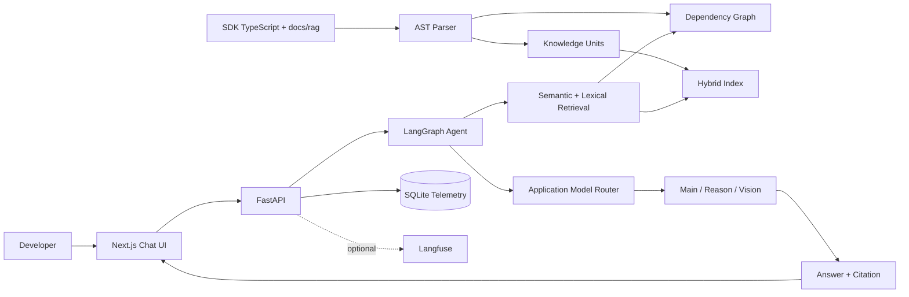
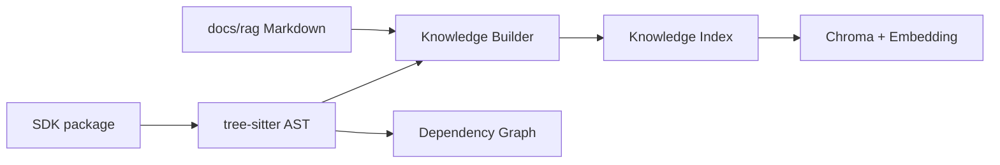
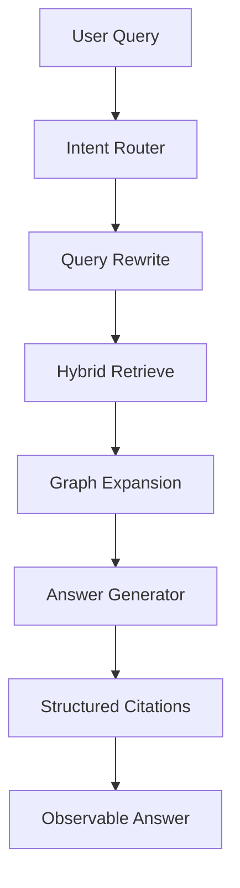
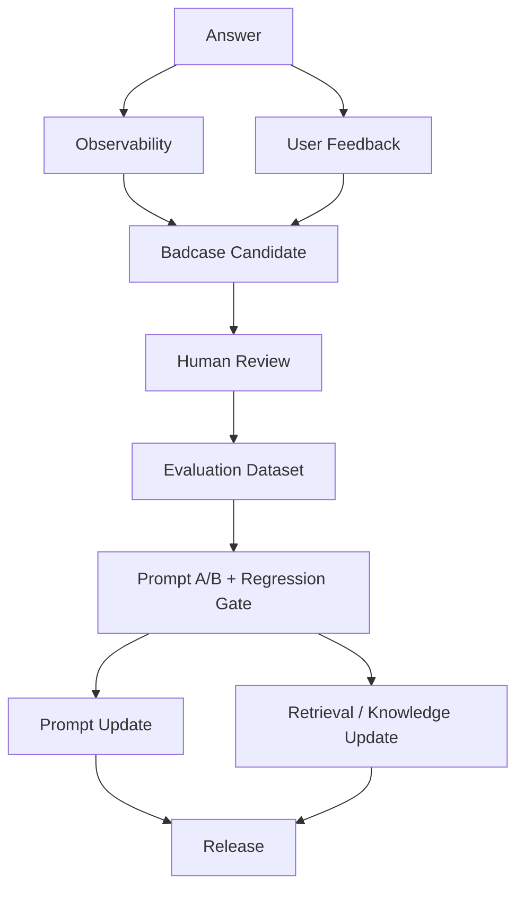

# Plugin Dev Helper

[](https://github.com/jonji886/plugin-dev-helper/actions/workflows/ci.yml)

> 面向 SDK / API / TypeScript 源码和插件开发文档的 **Enterprise Developer Copilot**。它把结构化知识构建、Hybrid RAG、LangGraph Workflow、可验证 Citation、Observability、用户反馈和离线评测连接成一个可持续改进的 AI 应用闭环。

本项目不是通用 Chatbot，也不是只展示向量检索的 PDF RAG Demo。目标用户是使用设计平台开放能力的研发人员；目标是让开发者更快找到正确 API、理解参数和源码、生成可执行示例，并能追溯答案依据。

## 30 秒概览

| 维度 | 实现 |
|---|---|
| What | SDK / API / 插件研发知识助手 |
| Knowledge | TypeScript AST 解析 + Markdown 文档 + 依赖图 |
| Retrieval | 语义检索 + API/别名词法检索 + 结果合并 + 依赖展开 |
| Agent | 意图识别 → 多轮问题重写 → 检索 → 图扩展 → 回答 |
| Trust | 结构化 Citation、证据不足时拒答、敏感信息不进入远程 Trace |
| Quality | Langfuse（可选）+ Feedback → Badcase → Regression Dataset → Prompt A/B Gate |
| Operations | SQLite 请求指标、延迟、token、估算成本、模型路由记录 |

## 1. 项目简介

开发者面对 SDK 和插件文档时，通常需要在类型定义、示例、开发规范和历史上下文之间反复切换。Plugin Dev Helper 将这些知识构建成可检索单元，在线通过 Agent 编排回答：

- 查询 API、接口、枚举、参数和返回值
- 解释 TypeScript SDK 源码与类型依赖
- 生成 SDK 调用示例
- 支持多轮上下文和结构化来源引用
- 采集单次回答反馈，沉淀可复核的 badcase

## 2. 为什么不是普通 RAG Bot

项目把“答案质量”当作工程系统来维护，而不是只看模型能否生成文本：

1. 知识不是原始文档堆积：SDK 经过 AST 解析，保留符号、命名空间、源码行号和版本信息；依赖图用于补充相关类型。
2. 检索不是单一路径：语义检索与 API 名称/别名/描述词法匹配合并，针对总览问题提升概览文档权重。
3. 回答不是无来源生成：Citation 从实际检索结果和知识索引装配，不能由 LLM 自行编造。
4. 质量不是一次性验收：线上请求与用户反馈进入 SQLite，负反馈可晋升为评测样例，Prompt 改动用同一 Golden Dataset 做离线 A/B 和回归门禁。
5. 模型选择是应用决策：Router 识别意图，Main 处理常规问答，Reason 处理代码/高复杂度任务，Vision 处理图片；缺少可选角色时明确回退并记录。

## 3. 核心能力与真实场景

典型问题包括：

- “`IDP.Miniapp.exit` 怎么调用？”——返回 API 说明、TypeScript 示例和源码位置。
- “`MiniappUploadDataOption` 有哪些字段？”——解释接口参数，并补充相关类型依赖。
- “工具插件的 UI 和 VM 分工是什么？”——从 RAG Markdown 文档回答架构和生命周期问题。
- “这个回答引用错了/没有找到正确文档。”——前端选择反馈原因，后端形成待复核 badcase。

## 4. 系统架构


```mermaid
flowchart LR
  SRC[SDK TypeScript + docs/rag] --> AST[AST Parser]
  AST --> KB[Knowledge Units]
  AST --> GRAPH[Dependency Graph]
  KB --> INDEX[Hybrid Index]
  U[Developer] --> FE[Next.js Chat UI]
  FE --> API[FastAPI]
  API --> AGENT[LangGraph Agent]
  AGENT --> RETRIEVE[Semantic + Lexical Retrieval]
  RETRIEVE --> INDEX
  RETRIEVE --> GRAPH
  AGENT --> ROUTER[Application Model Router]
  ROUTER --> MAIN[Main / Reason / Vision]
  MAIN --> ANSWER[Answer + Citation]
  ANSWER --> FE
  API --> SQL[(SQLite Telemetry)]
  API -. optional .-> LF[Langfuse]
```

### 4.1 离线 Knowledge & RAG Pipeline


```mermaid
flowchart LR
  A[SDK package] --> B[tree-sitter AST]
  D[docs/rag Markdown] --> C[Knowledge Builder]
  B --> C
  B --> G[Dependency Graph]
  C --> J[Knowledge Index]
  J --> V[Chroma + Embedding]
```

`data/knowledge/_index.json` 保存知识单元的 ID、来源文件、SDK 版本、别名和行号；`data/graph/` 保存依赖关系；`data/chroma/` 是构建产物。`data/` 不应手工编辑。

### 4.2 Agent Workflow


```mermaid
flowchart TD
  Q[User Query] --> I[Intent Router]
  I --> R[Query Rewrite]
  R --> S[Hybrid Retrieve]
  S --> X[Graph Expansion]
  X --> G[Answer Generator]
  G --> C[Structured Citations]
  C --> O[Observable Answer]
```

实际节点为：Intent Router、Query Rewrite、Retrieve、Graph Expansion、Answer Generator、Session Memory。没有为了展示而虚构 Tool Calling 或 Multi-Agent。

## 5. AI Quality Loop


```mermaid
flowchart TD
  A[Answer] --> O[Observability]
  A --> F[User Feedback]
  O --> B[Badcase Candidate]
  F --> B
  B --> R[Human Review]
  R --> D[Evaluation Dataset]
  D --> E[Prompt A/B + Regression Gate]
  E --> P[Prompt Update]
  E --> K[Retrieval / Knowledge Update]
  P --> REL[Release]
  K --> REL
```

负反馈不会直接被当成“标准答案”。Promote 前需要人工补充 `expected_answer`、`expected_keywords` 或 `reference_docs`，避免把用户情绪或错误判断污染 Golden Dataset。

## 6. Evaluation

已有评测保留以下指标：

- `Recall@1/3/5`
- `Answer Correctness`（关键词命中或明确拒答行为）
- `Citation Validity`
- `Reference Cited Rate`
- 平均延迟、token 和估算成本

使用同一批 Golden Dataset 比较两个 Prompt 版本：

```bash
python3 scripts/run_prompt_eval.py --baseline v1 --candidate v2
```

报告会输出两组指标和 Delta，并读取 [`eval/gate.json`](eval/gate.json) 判断 `PASS/FAIL`：Recall@5 或正确性下降超过 3%，或 Citation Validity 低于 90% 时失败。若没有可用模型密钥，应用只能运行本地兜底，不应把该结果冒充真实模型评测；评测输出也不作为仓库中的虚假生产结果。

评测脚本会把运行元数据一并写入 [`eval/prompt_eval_results.json`](eval/prompt_eval_results.json)，包括数据集 SHA-256、Prompt 元数据、当前四角色模型、价格配置版本、执行时间、失败样本和硬超时。Prompt A/B 为了隔离 Prompt 变量，评测阶段使用与生产规则一致的确定性任务分类；答案生成仍真实调用当前 `.env` 中的 Main/Reason/Vision 模型，报告标记为 `evaluation_mode=real_llm`、`router_mode=deterministic_for_eval`。

最近一次真实运行（2026-08-25，24 条 Golden Dataset，`ANSWER_CONTEXT_MAX_CHARS=6000`）结果：

| Metric | v1 | v2 | Delta |
|---|---:|---:|---:|
| Recall@5 | 91.67% | 91.67% | 0 |
| Answer Correctness | 91.67% | 91.67% | 0 |
| Citation Validity | 95.83% | 95.83% | 0 |
| Avg Latency | 22.6515s | 40.7276s | +18.0761s |
| Avg Tokens | 2,515.96 | 2,346.29 | -169.67 |
| Avg Cost | ¥0.00607583 | ¥0.00585354 | -¥0.00022229 |
| Failed Cases | 1/24 | 3/24 | +2 |

本次报告已修正为请求级 token/cost 统计：v1 的超时样本为 `q004`；v2 的超时样本为 `q008`、`q013`、`q020`。`rag002` 在上下文预算修复后两版本均完成，但分别耗时约 60 秒和 89 秒。v2 的 Gate 结果为 `FAIL`：正确性下降 8.34 个百分点、Citation Validity 降至 87.50%；没有填充答案或伪造指标，生产默认继续使用 v1。

只验证检索门禁、不调用 LLM：

```bash
python3 scripts/check_retrieval_gate.py
```

四角色真实路由验收使用 [`eval/model_routing_cases.json`](eval/model_routing_cases.json)，覆盖常规问答、代码、复杂推理和截图识别：

```bash
.venv/bin/python scripts/check_model_routing.py
```

脚本会校验每个响应的 `model_role` 是否符合预期，并保存 [`eval/model_routing_results.json`](eval/model_routing_results.json)。报告同时记录批次失败率、批次 token/cost 增量，以及 `/api/metrics` 返回的总延迟、P50/P95、LLM 延迟、token、估算成本和 `by_model_role` 分角色统计。该脚本会真实调用模型，适合发布前或配置变更后执行，不建议在每次单元测试中运行。

最近一次真实路由验收（2026-08-25）为 4/4 角色命中、0 失败：常规问答 → Main（DeepSeek V4 Flash），代码 → Reason（GLM-5.1），复杂推理 → Reason（GLM-5.1），截图识别 → Vision（Qwen3-VL-32B）。本批 `/api/metrics` 增量为 12,103 tokens、估算成本 ¥0.101654；全窗口快照为 P50 27.42s、P95 56.70s、失败率 0%。

## 7. Observability

Langfuse 是可选依赖和可选开关：

```bash
pip install -e ".[dev,observability]"
```

设置 `LANGFUSE_ENABLED=true` 后，单次 Trace 以 `request_id` 作为可关联 `trace_id`，记录用户问题、重写问题、意图、检索查询、文档 ID、chunks、scores、Top-K、Hybrid Merge 结果、来源类型、知识版本、Prompt 元数据、Provider、Model、路由原因、temperature、token、估算成本、检索/模型/总耗时、Citation 数量和有效性、成功状态及错误类型。默认关闭或 Langfuse 不可用时，主 Chat 链路继续运行，只记录 Warning；不写入 API Key 或完整系统 Prompt。

不会把 API Key、完整密钥或不必要的完整系统 Prompt 写入 Trace；答案用于调试时也会截断。

## 8. Feedback、Badcase 与 API

回答下方提供 `👍 有帮助` / `👎 没帮助`。负反馈可选择：回答错误、没有找到正确文档、引用错误、代码示例错误、回答不完整、其他，并填写可选说明。

主要接口：

| 方法 | 路径 | 说明 |
|---|---|---|
| POST | `/api/chat` | 文本/图片问答，返回 `request_id/trace_id`、回答、provider/model、路由角色/原因和 Citation |
| POST | `/api/chat/feedback` | 兼容旧调用方的反馈接口 |
| POST | `/api/feedback` | 统一反馈接口别名 |
| GET | `/api/badcases` | 查看 `NEW/REVIEWED/PROMOTED/IGNORED` 案例 |
| POST | `/api/badcases/{id}/promote` | 追加到 `eval/regression_cases.json` |
| GET | `/api/metrics` | 成功率、P50/P95、引用率、token、成本、反馈率 |
| GET | `/api/metrics/failures` | 查询无检索、无引用、错误或负反馈候选 |

SQLite 至少关联保存：`feedback_id/request_id(trace_id)`、session、query、answer、rating、reason、comment、Prompt 版本、model、时间；请求日志额外保存检索文档 ID、token 和 estimated cost。

图片请求最多 3 张，支持 `data:image/*;base64,...` 或 HTTPS 图片 URL；图片内容不会写入会话 SQLite，只在当前请求内传递给 Vision 模型：

```json
{
  "query": "请识别截图中的插件 API 用法",
  "session_id": "a1b2c3d4",
  "images": ["data:image/png;base64,..."]
}
```

## 9. Prompt Version Management

Prompt 采用 Git 管理，不引入额外 Prompt SaaS 或数据库：

```text
prompts/
├── developer_qa/v1.md
├── developer_qa/v2.md
├── query_rewrite/v1.md
└── intent_classifier/v1.md
```

[`prompts/manifest.json`](prompts/manifest.json) 维护每个版本的 `status`、`created_at` 和 `description`。每一次 LLM 调用会关联 `prompt_name`、`prompt_version` 和这些非敏感元数据。修改 Prompt 的理由、效果和评测结果应通过代码 Review、`CHANGELOG.md` 或评测报告保留。

## 10. Model Routing & Cost

`app/model_router.py` 是应用层路由器，不是独立 AI Gateway。当前默认采用四角色策略：

| 角色 | 配置 | 负责内容 | 触发条件 |
|---|---|---|---|
| Router | `ROUTER` | 意图、复杂度和置信度识别 | Agent 第一阶段 |
| Main | `MAIN` | 常规 SDK/API 知识库问答、问题重写 | 默认路径 |
| Reason | `REASON` | 代码示例、高复杂度或低置信度任务 | `code`、`high`、需要深度推理 |
| Vision | `VISION` | 截图、界面和图片内容理解 | 请求携带 `images` |

路由顺序是“先分类，再回答”：Router 只承担轻量分类；常规问题进入 Main；代码/复杂问题进入 Reason；带图片的最终回答进入 Vision。Vision 优先级高于文本复杂度，避免把多模态请求误派给纯文本模型。Router 结果会记录 `complexity/confidence/need_reason`，便于后续评测和调参；低置信度会升级到 Reason。确定性回退同时覆盖“分析、排查、分步骤、可能原因、推理”等复杂问题表达。

Router 使用独立的轻量预算：默认 `15s` 超时、`0` 次重试、最多 `256` tokens，避免分类失败拖慢主链路。Router 超时或返回非法 JSON 时，系统会基于原始问题调用 `infer_task_type()` 确定性回退，不会把普通问题盲目升级到 Reason。

当前 SiliconFlow 中转配置示例：

```dotenv
SILICONFLOW_BASE_URL=https://api.siliconflow.cn/v1
SILICONFLOW_API_KEY=your-key
ROUTER=Qwen/Qwen3-8B
MAIN=deepseek-ai/DeepSeek-V4-Flash
REASON=Pro/zai-org/GLM-5.1
VISION=Qwen/Qwen3-VL-32B-Instruct
```

如果同时配置官方 `DEEPSEEK_API_KEY`，系统通过 Adapter 为文本角色启用故障转移：SiliconFlow 的一次请求出现超时、连接断开、429 或 5xx 等可恢复错误后，Router/Main/Reason 默认切换到官方 `deepseek-v4-flash`。主 Provider 的重试默认降为 0，DeepSeek 备份调用默认最多等待 30 秒且不重试，避免两套重试叠加放大延迟。官方接口默认地址为 `https://api.deepseek.com`；可通过 `DEEPSEEK_FALLBACK_*_MODEL` 覆盖映射。Vision 默认不启用 DeepSeek 兜底，避免把不确定的图像能力当成可用能力。

如果四角色变量均未设置，系统继续兼容旧配置：`MODEL_GLM` → default、`MODEL_QWEN` → fast、`MODEL_DEEPSEEK` → strong；显式 `DEFAULT/FAST/STRONG_LLM_PROVIDER/MODEL` 优先级更高。缺失的可选角色会回退到 Main，并在 `GET /api/ready` 的 `model_role_status` 标记 `fallback=true`。

路由不会把 API Key 写入响应或 Trace；`GET /api/ready` 会返回脱敏后的 `model_routes`、已绑定的 `fallback_routes` 和各角色可用性。SiliconFlow 使用 OpenAI-compatible 接口，模型 ID 必须使用平台中实际可用的模型标识；Vision 角色应配置支持图像输入的模型。

价格集中在 [`config/model_pricing.json`](config/model_pricing.json)，每次调用从 provider response metadata 读取 token，缺失时使用明确的字符数估算，并计算 `estimated_cost`。当前四角色绑定的官方价格（每百万 Token，CNY，抓取于 2026-08-24）如下；GLM-5.1 Pro 按输入是否超过 32K 分档：

| 角色 | 模型 | 输入 | 输出 |
|---|---|---:|---:|
| Router | `Qwen/Qwen3-8B` | ¥0 | ¥0 |
| Main | `deepseek-ai/DeepSeek-V4-Flash` | ¥1 | ¥2 |
| Reason | `Pro/zai-org/GLM-5.1` | ¥6 / ¥8（>32K） | ¥24 / ¥28（>32K） |
| Vision | `Qwen/Qwen3-VL-32B-Instruct` | ¥1 | ¥4 |

价格来源为[硅基流动官方模型价格中心](https://cloud-rd.siliconflow.cn/pricing)，价格可能随账户、时段和平台政策变化；未知模型仍只统计 Token，成本显示为 `0`，不会伪造金额。

官方 DeepSeek 兜底默认使用 `deepseek-v4-flash`，成本配置按官方价格中心的 cache-miss 输入价格估算为 `$0.14/$0.28`（输入/输出，每百万 Token）；配置文件同时保留 `deepseek-v4-pro` 的可选价格记录。价格可能随峰谷时段和官方政策变化，详见[DeepSeek 官方模型与价格](https://api-docs.deepseek.com/quick_start/pricing/)。

## 11. Reliability & Safety

- Langfuse 默认关闭，远程上报失败不影响业务请求。
- LLM 超时、重试次数、检索 Top-K 都由环境变量控制；当前中转配置建议 `LLM_TIMEOUT_SECONDS=60` 供 Main/Reason/Vision 使用，Router 使用独立的 15 秒预算。
- Provider 通过 Adapter 隔离；SiliconFlow → 官方 DeepSeek 的故障转移只对超时、连接错误、429 和 5xx 等瞬时错误生效，401/403/422 等配置或请求错误不会盲目切换。
- 服务启动阶段会预热本地 embedding 模型；`GET /api/ready` 返回 `embedding_ready` 和 `embedding_warmup_ms`，避免首个用户请求承担模型加载成本。
- 每个请求在上下文隔离范围内统计 token 和估算成本，不会把前序请求的累计值重复写入当前请求；`ANSWER_CONTEXT_MAX_CHARS` 默认限制证据上下文为 6000 字符，Relay 较慢时可适当下调。
- 模型不可用时返回本地知识库兜底内容，不伪装成模型答案。
- 无证据时明确拒答；Citation 由后端索引校验，不能由模型随意生成。
- CORS 默认只允许本地前端；生产环境显式配置 `FRONTEND_ORIGINS`。
- SQLite 是个人作品集规模的低运维选择；Redis、SSE、WebSocket、Multi-Agent、Kubernetes 和微服务拆分留在 P1/P2。

### 已知限制

- 当前模型路由仍是应用层规则路由；Prompt A/B 评测阶段使用确定性分类以隔离 Router 网络波动。
- Feedback 晋升回归集前需要人工 Review，系统不会自动把负反馈当成标准答案。
- `estimated_cost` 是基于公开价格配置的估算值，不等同于账户最终账单；不同货币的历史模型配置不可直接横向相加。
- 当前 Golden Dataset 为 24 条，足以做回归门禁，但不能代表完整生产分布。
- SiliconFlow 中转的长响应可能出现偶发长等待；应用已限制 Router 预算并限制答案上下文，但 Main/Reason/Vision 的最终可用性仍取决于上游超时和重试配置。
- Langfuse 是可选依赖；未开启或远端不可用时只能查看本地 SQLite 指标，不能查看远程 Trace。

## 12. 技术选型与取舍

| 选择 | 原因 |
|---|---|
| LangGraph | 让多步 Agent 状态和节点边界显式化，便于定位检索/生成问题 |
| Chroma + sentence-transformers | 本地可部署、成本低，适合个人作品集规模 |
| SQLite | 请求指标、反馈和 badcase 需要持久化，但当前规模不需要引入数据库服务 |
| Git-based Prompt | 版本可 Review、可回滚、与 Prompt A/B 天然关联 |
| Langfuse optional | 复用成熟 Trace 产品，同时保证可观测性不是核心链路依赖 |

## 13. 技术栈

Python 3.11、FastAPI、LangGraph、LangChain OpenAI-compatible Client、Chroma、sentence-transformers、tree-sitter、SQLite、Next.js 16、React 19、Tailwind CSS 4。

## 14. 快速启动

前置：Python 3.11+、Node.js 18+。推荐配置 SiliconFlow 中转 API；没有模型密钥时服务仍能展示本地知识库兜底结果。

```bash
python3.11 -m venv .venv
.venv/bin/pip install -e ".[dev]"
npm install
cd frontend && npm install && cd ..
cp .env.example .env
.venv/bin/python scripts/run_pipeline.py
.venv/bin/uvicorn app.main:app --reload --port 8000
```

另开终端启动前端：

```bash
cd frontend && npm run dev
```

打开 `http://localhost:3000`，或访问 `http://localhost:8000/api/health` 验证后端。

如需 Langfuse：`.venv/bin/pip install -e ".[dev,observability]"`，再在 `.env` 中填写配置。Docker 部署配置位于 [`deploy/docker-compose.yml`](deploy/docker-compose.yml)，镜像默认复制已构建知识库和 embedding 缓存。

## 15. 测试与验证

```bash
.venv/bin/pytest -q
cd frontend && npm run lint
cd frontend && npm run build
```

重点测试覆盖 SDK 解析、混合检索、Citation、会话持久化、运行时路径、SQLite 指标/反馈和 API；专项测试覆盖 Prompt Registry、价格分档、Provider 不可用和 Langfuse Fail Open；离线评测覆盖检索召回、答案关键词和引用有效性。

真实 Prompt A/B 评测：

```bash
EVAL_CASE_TIMEOUT_SECONDS=90 .venv/bin/python scripts/run_prompt_eval.py --baseline v1 --candidate v2
```

导出历史失败候选：

```bash
.venv/bin/python scripts/export_failure_cases.py --database data/app.sqlite3 --output eval/failure_candidates.jsonl
```

## 16. 项目结构

```text
app/                 FastAPI、配置、SQLite、Observability、Router、Prompt Registry
agent/               LangGraph 节点、会话、模型调用与 Citation
vector_store/        Chroma 与混合检索
knowledge_builder/   知识单元构建
sdk_parser/          TypeScript AST 解析
prompts/             Git-based Prompt 版本
eval/                Golden Dataset、评分、A/B 报告与 Regression Gate
scripts/             知识构建、失败案例导出、评测入口
frontend/            Next.js Chat UI 与 Feedback UI
deploy/              Docker 镜像与 Compose
```

## 17. Roadmap

- P0（当前）：Observability、Feedback、Badcase、Prompt 版本、离线 A/B、回归门禁、模型路由、token/cost 和质量闭环。
- P1：更细粒度 Citation 验证、人工评审页面、检索/回答质量仪表盘、批量数据导入。
- P2：在真实规模和合规要求驱动下再评估 Redis、流式响应、权限体系、服务拆分和更复杂的 Gateway。

## 许可证

本项目仅供内部学习、演示和作品集展示。
