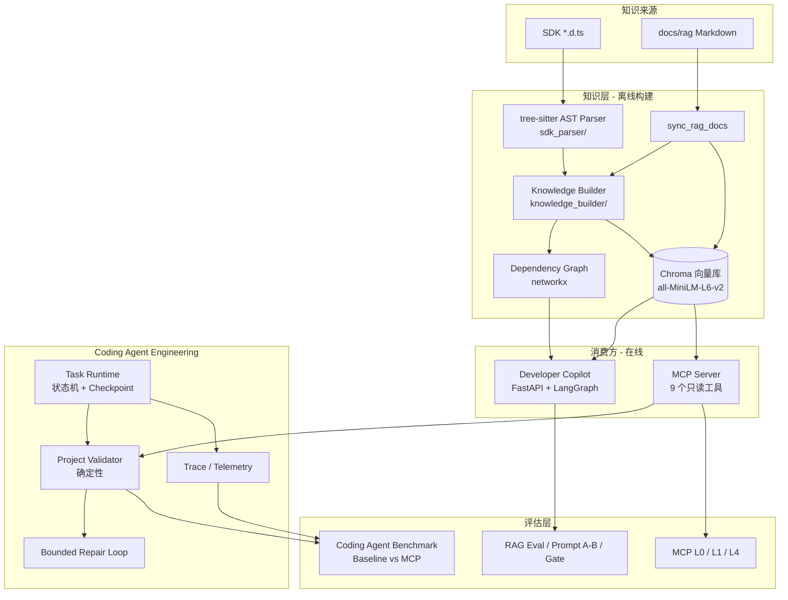

# SPEC：Plugin Dev Helper

版本: v2.0
负责人: Season
状态: Living Document（与代码同步维护）

> 本文档描述**当前真实实现**的系统定位、架构、可靠性模型、评估体系与验收标准。
> 所有内容以仓库代码为事实来源（Source of Truth）：实现了什么就写什么，未实现的能力
> 明确标记，未执行的实验标记 NOT_RUN，不可获取的数据标记 UNAVAILABLE。

---

# 1. Problem / Background

某设计平台开放平台向第三方提供插件二次开发能力（OpenAPI / JS-TS SDK / 插件框架）。围绕这套能力，
真实存在的工程问题不是「缺一个聊天机器人」，而是：

- **开发知识分散**：SDK 类型定义（`*.d.ts`）、开发规范、方案导出说明散落在多个来源，检索成本高。
- **SDK 类型复杂**：命名空间深（`IDP.Custom.Common.*`）、类型/枚举/可选参数多，凭记忆容易用错。
- **API 易幻觉**：模型与编码助手容易生成「看起来合理但并不存在」的 API（如 `IDP.Miniapp.exitMiniapp`），
  或写错参数名、命名空间。
- **Coding Agent 缺少领域上下文**：通用编码助手没有本平台 SDK 的结构化知识，也没有平台级强制约束
  （UI/VM 职责、iframe 通信、本地 HTTP Server、CORS/OPTIONS 等）。
- **生成代码缺少确定性验证**：LLM 产出不可信，需要不依赖 LLM 的确定性校验来判定「是否可交付」。
- **AI 系统效果难量化**：RAG / MCP / Agent 的真实增益如果不可测量，就只能靠主观描述。

# 2. Goals

- 提供**可信的 SDK/API 查询**：精确定位符号、参数、返回值、源码行号与 SDK 版本。
- 支持 **Coding Agent 获取领域知识**：通过 MCP 把结构化能力暴露给宿主 IDE / Agent。
- **降低 API 幻觉**：查询侧精确匹配 + 校验侧确定性检测 + 拒答语义。
- 生成结果经过 **deterministic validation**：项目级校验不依赖 LLM。
- 支持 **质量追踪与回归**：请求级观测、Prompt A/B、回归门禁、分层评测。
- 能够 **定量验证 MCP 对 Coding Agent 的价值**：Baseline vs MCP 控制变量实验。

# 3. Non-goals

明确不做（避免被误解为通用平台）：

- **不是通用 Coding Agent**：不提供通用代码生成/改写能力，只聚焦本平台 SDK / 插件开发。
- **不是 IDE**：前端是知识问答与反馈界面，不是代码编辑器。
- **不是模型训练平台**：不训练/微调模型，只做应用层编排与路由。
- **不是生产插件宿主**：不提供插件运行时，不替代平台官方 Runtime。
- **不替代平台规范**：Rule Layer 是项目内维护的 POC 约束集，不代表官方规范的完整或永久版本。

# 4. Users / Use Cases

| 角色 | 场景 | 依赖能力 |
|---|---|---|
| Developer | 查 API 怎么用、参数怎么构造、源码在哪 | Chat（RAG + Citation） |
| Support / Solution Engineer | 复用标准答案、沉淀 badcase、看指标 | Observability + Feedback + Eval |
| Coding Agent（宿主 IDE） | 在本平台插件工程里写代码、修错、做平台约束自检 | MCP Tools + Validator |
| 项目维护者 | 改 Prompt / 检索 / 规则后做回归 | Prompt A/B + Regression Gate + 分层评测 |

# 5. System Architecture



说明：Copilot 与 MCP **共享同一份知识索引与向量库**（MCP 只读复用 `VectorStore.search_hybrid`）。
Task Runtime 与 MCP / Chat 一样调用同一个 `ProjectValidator`。Benchmark 复用同一 Validator 与轨迹评分器。

# 6. Knowledge Layer

真实实现：

- **TypeScript AST 解析**（`sdk_parser/parser.py`）：基于 **tree-sitter** + `tree_sitter_typescript`
  解析 `*.d.ts`，提取 interface / type_alias / enum / class / function / const、参数、属性、方法、
  枚举、泛型与 JSDoc（含 `@deprecated`）。
- **符号模型**（`sdk_parser/models.py::Symbol`）：`aliases` 自动生成（短名 + 逐级命名空间前缀）；
  `start_line` / `end_line` 保留源码行号；`sdk_version` 默认 `1.83.0`。
- **知识产物**（`knowledge_builder/builder.py::KnowledgeBuilder`）：为每个符号写
  `data/knowledge/<id>.md` + `<id>.json`，并汇总 `data/knowledge/_index.json`
  （字段：id / name / type / namespace / description / aliases / source / sdkVersion /
   mdFile / jsonFile / references / startLine / endLine / contentHash）。
- **文档知识**（`scripts/sync_rag_docs.py`）：把 `docs/rag/**/*.md` 转成 `namespace="docs.rag"` 的知识单元。
- **依赖图**（`GraphBuilder`，位于 `knowledge_builder/builder.py`）：用 **networkx** 构建有向图，
  输出 `data/graph/dependency_graph.json`。
  - 注意：`graph_builder/` 目录当前为空占位，依赖图实现实际在 `knowledge_builder/` 内。
- **Hybrid Retrieval**（`vector_store/store.py`）：Chroma（`data/chroma`，collection `sdk_knowledge`，
  cosine）+ 自定义**词法打分**（符号/别名子串匹配 + 中文 bigram）合并。
  - 诚实说明：词法侧是自研轻量打分，**不是 BM25**，也不是标准稀疏检索。

# 7. Developer Copilot / RAG

- **后端**（`app/main.py`，FastAPI）：`/api/chat`、`/api/health`、`/api/ready`、`/api/metrics`、
  `/api/metrics/failures`、`/api/badcases*`、`/api/feedback` 等。
- **Agent 编排**（`agent/assistant.py`，LangGraph `StateGraph`），固定节点顺序：
  1. `intent_router`：识别意图/复杂度/置信度（LLM 输出 JSON，失败降级到确定性 `infer_task_type()`）。
  2. `query_rewrite`：仅当多轮（`len(messages) > 2`）时用 LLM 重写。
  3. `retrieve`：`VectorStore.search_hybrid`。
  4. `graph_expansion`：按 `dependency_graph.json` 展开相关类型并读取知识 md。
  5. `answer_generator`：生成回答。
- **Citation 装配方式**：**由系统确定性装配**（`agent/assistant.py::build_citations()` 依据
  `retrieved_docs` + `_index.json`），**不是 LLM 生成**。`citation_validity` 校验每条引用必须指向已检索文档。
- **模型路由**（`app/model_router.py`）：Router / Main / Reason / Vision 四角色（或旧三 profile）。
  默认 provider `deepseek`（`app/config.py`）。`app/llm_adapter.py` 基于 `langchain_openai.ChatOpenAI` 构造
  OpenAI 兼容适配器；**DeepSeek 故障转移真实存在**（`_deepseek_fallback_route()` + `FailoverAdapter`，
  仅对瞬时错误生效，Vision 默认不兜底）。

# 8. MCP Layer

服务：`mcp_server/`（FastMCP，**Streamable HTTP**，默认 `0.0.0.0:8001`，端点 `/mcp`；
另有 `GET /health`、`GET /ready`）。每个工具经 `container.telemetry.guarded(...)` 包裹，
异常收敛为 `{status:"error", error_type, message}` 并附加 `request_id/tool/duration_ms`。

当前真实注册 **9 个只读工具**（`mcp_server/tools/__init__.py`）：

| Tool | purpose | input | output（要点） | failure 语义 |
|---|---|---|---|---|
| `search_docs` | 自然语言检索 SDK/API/文档 | `query`, `top_k`, `sdk_version` | `status/result_count/results[]`，含 `mode=hybrid\|keyword_fallback` | 无结果 `not_found`；向量不可用降级 `keyword_fallback` |
| `get_api` | 按符号精确查 API | `symbol`, `sdk_version` | `signature/parameters/aliases/related_types/source_lines/location` | 未命中 `found:false,status:not_found,candidate_symbols[]`（不冒充精确结果） |
| `get_type` | 查 interface/type/enum | `name`, `sdk_version` | `fields[]/enum_members[]/dependencies[]` | 未命中 `not_found + candidate_symbols` |
| `get_related_symbols` | 依赖/被引展开 | `symbol`, `depth`(1–3) | `dependencies[]/referenced_by[]` | 无关系 `not_found` |
| `get_examples` | 返回真实代码示例 | `symbol`, `language`, `sdk_version` | `examples[{code,verified_source,match}]` | 无可信示例 `not_found`，**不临时生成** |
| `validate_api_usage` | 单段代码 API 用法静态校验 | `code`, `sdk_version` | `issues[{type,severity,symbol,line,suggestions}]`，`status=ok\|invalid` | 有问题 `status:invalid` |
| `get_plugin_constraints` | 平台结构约束（Rule Layer） | `platform`, `component`, `task` | `constraints[]/required_patterns[]/references[]` | 非 kujiale `not_supported` |
| `get_plugin_scaffold` | 最小插件骨架 | `platform`, `plugin_type`, `stack`(`vanilla`/`react-ts-webpack`) | `files{}/responsibilities/communication_pattern/guidance` | 非 kujiale/tool_plugin `not_supported`；未知 stack `unsupported_stack` |
| `validate_plugin_project` | 项目级确定性校验 | `project_dir`, `sdk_version` | `ValidationResult.as_dict() + status/message` | 目录非法 `status:error, invalid_project_dir` |

# 9. Coding Agent Engineering

以下能力均**真实实现**，各自边界见「现状」列。

| 组件 | 位置 | 现状 |
|---|---|---|
| Project Validator | `mcp_server/services/project_validator.py` | 五类检查：STRUCTURE / MANIFEST / RULE / API / BUILD；统一 Issue（issue_id/severity/category/code/file/line/evidence/suggested_fix/repairable）；CORS/OPTIONS/HTTP 探活标记 `runtime_required=True`（WARNING，不静态宣布通过） |
| Task Runtime | `agent/runtime/task_runtime.py` | 状态机驱动生命周期、SQLite 持久化、Checkpoint、`resume()` 从最新 checkpoint 恢复、Retry（`errors.py` 策略）、ArtifactVersion、Trace。**边界**：`_do_build` 在缺少 `tsc_cmd` 时不真正构建，显式标注「build skipped」而非伪造通过 |
| State Machine | `agent/runtime/state_machine.py` | 显式合法迁移表，非法迁移抛 `IllegalTransitionError` |
| Artifact Version | `agent/runtime/task_runtime.py::_save_artifact` | 每次产出 v1/v2…，与 TraceEvent 关联 |
| Checkpoint / Resume | `agent/runtime/task_runtime.py` + `repositories.py` | checkpoint 落盘（含 validation_*.json）；`resume()` 从中断处继续 |
| Repair Loop | `agent/runtime/repair.py` | `BoundedRepairLoop(max_attempts=2)`；证据驱动，仅取上轮 `repairable` 且 severity∈{CRITICAL,HIGH} 的 Issue；修复后生成新 ArtifactVersion 并**重校验**；默认 `EvidenceBasedRepairDriver` 为确定性（无 LLM，仅替换 `API_UNKNOWN_API` 幻觉符号） |
| Failure Taxonomy | `agent/runtime/errors.py` | RETRIEVAL / KNOWLEDGE_MISSING / API_HALLUCINATION / API_PARAMETER / RULE_VIOLATION / MANIFEST / PERMISSION / SDK_VERSION / MODEL / PROVIDER / MCP / VALIDATION / BUILD / RUNTIME / CHECKPOINT / UNKNOWN；附 `FailureClass`(RETRYABLE/REPAIRABLE/NON_RETRYABLE) 与 `RetryPolicy` |
| Trace | `agent/runtime/trace.py` | `TaskTraceRecorder`（Task→Run→Step）；`analyze_root_cause()`（First Divergence Principle）把 Issue 映射到 Taxonomy 并落 FailureRecord |

# 10. Reliability Model

核心不变量：**LLM 输出不可信**。

```text
LLM / Agent output（不可信）
        ↓
Structured / deterministic validation（Project Validator，不依赖 LLM）
        ↓
   ┌─────────────┬──────────────┐
   PASS          REPAIR          REJECT / FAILED
   ↓             ↓（有界 2 次）       ↓
  交付        重新校验           记录 FailureRecord + 根因
```

区分三类可靠性：

- **model reliability**：LLM 输出有随机性与幻觉 → 不把 Prompt 当作可靠性边界，用确定性校验兜底。
- **tool reliability**：MCP 工具异常被 `telemetry.guarded` 收敛为结构化错误；未命中返回 `not_found`
  而不返回近似结果；检索向量不可用时降级 `keyword_fallback`。
- **business / platform constraints**：Rule Layer 的「必须/禁止」由确定性规则检查；
  宿主运行期行为（CORS / OPTIONS / HTTP 探活）**无法静态判定**，显式标记 `HOST_VALIDATION_REQUIRED`。

# 11. Evaluation System

| 层 | 目标 | 需要 LLM？ | 确定性 | 状态 | 命令 |
|---|---|---|---|---|---|
| RAG Eval | Recall@1/3/5 + 答案正确性 + Citation Validity | 是 | 评分确定性 | 已执行（有真实报告） | `python eval/run_eval.py` |
| Prompt A/B + Regression Gate | 同数据集比较两 Prompt 版本 | 是 | Gate 确定性 | 已执行（有真实报告） | `python scripts/run_prompt_eval.py --baseline v1 --candidate v2` |
| 检索门禁 | 不调 LLM 的检索质量门禁 | 否 | 是 | 可执行 | `python scripts/check_retrieval_gate.py` |
| MCP L0（工具级） | 契约/边界/not_found/降级/异常隔离/幂等（`mcp_golden.json`，58 条） | 否 | 是 | 已执行，GATE PASS | `python scripts/run_mcp_eval.py` |
| MCP L1（多轮序列） | 跨步骤引用/指代传递（`mcp_sequences.json`，6 条） | 否 | 是 | 已执行，6/6 | `python scripts/run_mcp_sequences.py` |
| Agent L2（轨迹） | 工具选择 P/R/F1、符号覆盖、冗余率、序列合规、拒答正确性 | 否（消费轨迹） | 是 | 已有真实轨迹（本仓库 Benchmark run） | `python scripts/check_agent_trace.py benchmark/traces/<run>.json` |
| Agent E2E L3 | Baseline vs MCP 端到端任务成功率 | 是（真实 Agent） | 评分确定性 | 已执行（manual，runs=1，见 §12） | `python scripts/run_coding_agent_benchmark.py --driver codebuddy-manual --prepare/--import` |
| MCP L4（稳定性） | 多轮 × 工具 + 并发 + 故障恢复 + 状态泄漏 | 否 | 是 | 已执行，GATE PASS | `python scripts/check_mcp_stability.py` |

判定原则：**核心成功判定使用确定性指标（Validator + acceptance + 轨迹评分），不以 LLM Judge 为准。**

# 12. CodeBuddy Benchmark（Baseline vs MCP）

真实执行（`benchmark/results/codebuddy-20260921-155307/`）：

- **Agent**：CodeBuddy（本机 CLI 存在，但无 headless 采集接口；采用 manual/import 驱动）
- **控制变量**：唯一差异为是否可访问 Plugin Dev Helper MCP；Agent / 任务集 / fixture / evaluator /
  validator / acceptance 固定。模型元数据 CodeBuddy 未提供 → `UNAVAILABLE`。
- **任务**：10 个（API 查找 / 类型构造 / 枚举 / UI-VM 通信 / 事件 / 修改既有代码 / 修错误 API /
  修错误参数 / 拒绝编造 / 信息不足先查询）
- **重复**：1 run/task（**不声称统计稳定**）
- **Trace**：MCP 条件采集真实 MCP 调用轨迹，归一化到 canonical schema，由 `check_agent_trace.py` 评分；
  baseline 无 MCP 调用轨迹
- **Evaluator**：`ProjectValidator`（确定性）+ acceptance 字符串断言，不使用 LLM Judge

结果（1 run/task）：

| Metric | Baseline | MCP | Delta |
|---|---:|---:|---:|
| Task Success Rate | 0.6 | 1.0 | +0.4 |
| API Correctness | 0.7 | 1.0 | +0.3 |
| Hallucination Rate | 0.3 | 0.0 | -0.3 |
| Constraint Violation Rate | 0.1 | 0.0 | -0.1 |
| Abstention Correct Rate | 0.5 | 1.0 | +0.5 |
| Latency / Token | UNAVAILABLE | UNAVAILABLE | — |

**Reference Driver**（`scripts/agent_drivers/reference.py`）仍保留，仅用于 harness / evaluator 自检
（确定性 stand-in），**不是 Agent Benchmark**，其数据与真实 Agent 数据完全分开。

# 13. Observability

真实实现（`app/metrics_store.py` → `data/app.sqlite3`）：

- `request_logs`：`request_id`、session、query、intent、rewritten_query、retrieved/citation 计数、
  `retrieval_ms/llm_ms/total_ms`、status、provider/model/model_role/route_reason、
  `input/output/total_tokens`、`estimated_cost`、prompt_name/version。
- `feedback`、`badcases`（负反馈 → 人工 Review → Promote 到 `eval/regression_cases.json`）。
- `mcp_tool_logs`（MCP 调用）；`mcp_metrics()` 给出每工具 total/success/failed/avg/p50/p95/p99。
- **Langfuse 可选**（`app/observability.py`，`LANGFUSE_ENABLED` 控制，缺 SDK 时 Noop，不进关键路径）。
- 不写入 API Key / 完整系统 Prompt；答案调试输出会截断。

# 14. Security / Trust Boundary

| 项 | 状态 |
|---|---|
| Citation 由系统索引校验，不由 LLM 生成 | Implemented |
| 无证据时拒答；MCP 未命中返回 `not_found` 而不编造 | Implemented |
| MCP DNS rebinding 防护（默认仅放行 localhost Host 头） | Implemented |
| MCP 默认放开跨域（`*`），需显式收紧 `MCP_ALLOWED_ORIGINS` | **Known Gap / 需配置** |
| 不记录代码、Token、凭据到 MCP telemetry | Implemented |
| CORS / OPTIONS 预检静态不可判定，标记需宿主验证 | Implemented（标记）+ Known Gap（不自动判定） |
| 多租户鉴权 / 权限体系 | **Known Gap（未实现）** |
| Prompt 注入防护 / 输出内容安全过滤 | **Known Gap（未实现）** |

# 15. Acceptance Criteria

项目级验收（当前）：

- **Knowledge build 可复现**：`python scripts/run_pipeline.py` 产出 `data/knowledge/_index.json`、
  `data/graph/dependency_graph.json`、`data/chroma/`。
- **RAG 回归门禁**：`eval/gate.json` 阈值（Recall@5 / Correctness 下降 ≤0.03，Citation Validity ≥0.90）。
- **MCP deterministic gate**：`python scripts/run_mcp_eval.py` 与 `run_mcp_sequences.py` GATE PASS。
- **Validator**：五类检查可运行；`validate_plugin_project` 对合法工程 `valid=true`。
- **Runtime tests**：状态机非法迁移报错、Checkpoint/Resume 可用、Repair 有界收敛。
- **Benchmark harness**：`reference` 自检通过；`codebuddy-manual` 支持 prepare/import；
  `codebuddy-cli` 无法采集时显式 NOT_RUN。
- **CodeBuddy 实验**：已完成一轮真实实验（runs=1），结果文件可复现。
- **Documentation consistency**：本 SPEC 与 README 中的技术名词均可在代码中找到依据。
- **测试全绿**：`pytest tests/ -q`。

# 16. Known Limitations

- Fixture 是最小 TypeScript 工程，不等价于真实宿主插件运行环境。
- 真实 CodeBuddy Benchmark 为 **1 run/task（manual）**，样本量小，不代表统计稳定结论。
- CodeBuddy 的 token / cost / latency 无法程序化获取 → `UNAVAILABLE`（不估算、不伪造）。
- baseline 是否真正禁用全局 MCP 取决于 CodeBuddy 配置合并行为（已在 metadata 披露）。
- `TaskRuntime._do_build` 在无 `tsc_cmd` 时不真正执行构建。
- ADR-003 提到「连续两轮 Issue 无变化即止损」，代码中未显式实现该判定。
- 检索词法侧为自研关键字打分，非 BM25；`graph_builder/` 为空占位。
- acceptance 基于字符串断言，注释中出现被禁符号也会导致 `not_contains` 失败（已在本轮 T07 中观察到）。
- Chat Golden Dataset 为 24 条，足以回归但不代表完整分布。
- MCP 默认放开跨域；无多租户鉴权与内容安全过滤。

# 17. Future Work

仅列**尚未实现且确有价值**的事项（不引入无需求支撑的复杂组件）：

- Coding Agent Benchmark 自动化：补齐 CodeBuddy headless / transcript 采集，支持 `--runs N` 批量。
- 扩大 Benchmark 任务集与重复次数，建立统计置信区间。
- Repair Loop 接入真实 LLM 驱动（当前默认确定性），并实现 ADR-003 的「无变化即止损」。
- `TaskRuntime._do_build` 真正执行构建（配置 tsc）。
- MCP 鉴权与内容安全过滤；`graph_builder/` 归位或删除空目录。
- 依赖图的检索侧更深度利用（当前用于 graph expansion）。
